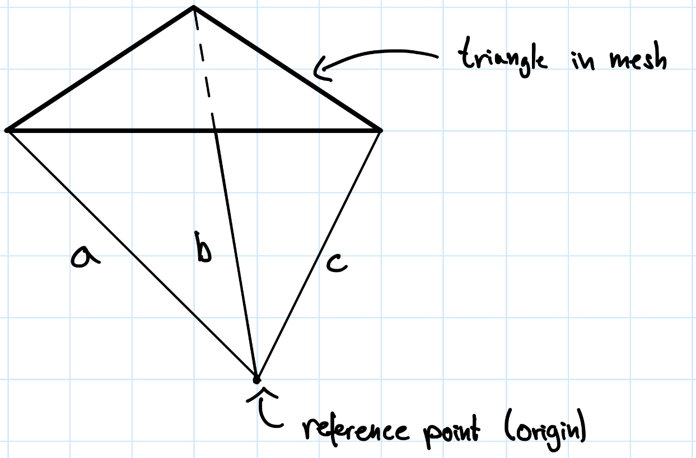

# exercises - series 8

## team members

- Simon Kolly
- Niklas Radomski
- Nicolas Willimann

## exercise notes

### exercise 3: implicit smoothing

Advantages of assembling a linear system in every iteration:

- accuracy
  - vertex positions are updated in every iteration, which causes cotan angles and vertex areas to change
  - cotan angles and vertex areas are encoded in $A$ and $b$

Disadvantages of assembling a linear system in every iteration:

- performance
  - requires full iteration over mesh to determine cotan angles and vertex areas
  - redundant when using uniform weights, as uniform weights solely depend on topology and not on geometry
    - vertex position updates only affect the latter, not the prior

### exercise 4: volume preservation

In order to determine a single triangle's contribution to the total volume of a closed triangle mesh, we determine the (signed) volume of the tetrahedron that this triangle forms with some reference point.
We refer to the edges that connect the triangle to the reference point as $a$, $b$, and $c$, as the following illustration depicts:



The signed volume of this tetrahedron is given by

$$
V = \frac{1}{6} \cdot \det\left[a \vert b \vert c \right]
$$

If we now scale every such edge by some scaling factor $s$, the volume changes as follows:

$$
\begin{align*}
V &= \frac{1}{6} \cdot \det\left[s \cdot a \vert s \cdot b \vert s \cdot c \right] \\
&= \frac{1}{6} \cdot s^3 \cdot \det\left[a \vert b \vert c \right]
\end{align*}
$$

## encountered difficulties

### exercise 3: implicit smoothing

The compatibility of diagonal matrices and sparse matrices in eigen is limited.
This causes variant 1 to be refused by the compiler, even though variant 2 compiles smoothly.

```cpp
// variant 1:
// SpMat system = diag_vector.asDiagonal() - (settings.timestep * laplacian_coefficients);

// variant 2:
SpMat system = -(settings.timestep * laplacian_coefficients);
system += diag_vector.asDiagonal();
```
