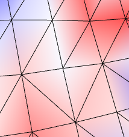
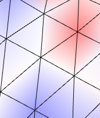
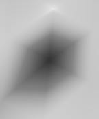

# exercises - series 5

## team members

- Simon Kolly
- Niklas Radomski
- Nicolas Willimann

## exercise notes

### exercise 1 - computing vertex normals

#### differences

- cylinder
  - uniform: zig-zag reflections
  - angles: straight reflection lines
  - area: same as uniform
    - triangle structure is regular which implies that all triangles have the same area
    - equivalent to uniform weights
- sphere:
  - uniform: three round reflections ("bowling ball")
  - angles: same as uniform
  - area: same as uniform
    - triangle structure is regular in most places, exceptions apply
- irregular sphere:
  - uniform: three round reflections "wobble" during rotation
  - angles: reflections keep their shape even when rotating past the irregularities
  - area: same as uniform, though wobbling pattern is not identical
- bunny:
  - uniform: reflections are of rougher shape in the creases
  - angles: reflections make a smoother impression
  - area: even rougher than uniform, especially in regions with high curvature
- eight:
  - equivalent for all three methods, except for slight displacement of reflections
- scanned face
  - differences are visible around eyebrows and eyelids
    - more generally: large areas that have high curvature on their boundary
  - uniform and angle: show minor but no structural differences
  - area: significantly sharper contrast

#### performance penalty of chosen abstraction

The separate calculation of weights increases the number of vectors for which we need to calculate the norm.
If we weren't required to condense every face's contribution into a scalar, we could do the following instead:

- For every face, we determine the cross product.
  The resulting vector does not only indicate the area of the corresponding face (twice as large) but is also the normal vector of that face.
- When we determine the normal vector of a vertex, we simply add the cross product vectors of all adjacent faces, and normalize the resulting vector.

As opposed to the weight-based implementation, this method does not require any pre-existing normal vectors.

### exercise 2 - Gauss curvature

According to the Gauss-Bonnet theorem, it holds that:

$$
\begin{align*}
\int_\Omega K dA + \int_{\delta \Omega} k_g ds = 2 \pi \chi(\Omega) \\
\int_\Omega K dA = 2 \pi \chi(\Omega) - \int_{\delta \Omega} k_g ds
\end{align*}
$$

To approximate the Gauss curvature, we divide by the area that we integrate over:

$$
\begin{align*}
K(v) &\approx \frac{1}{|A(v)|} \int_{A(v)} K dA &= \frac{1}{|A(v)|} \left( 2 \pi \chi(\Omega) - \int_{\delta \Omega} k_g ds \right )
\end{align*}
$$

All of this holds without loss of generality.

Now, to obtain a local estimate of Gauss curvature, we only consider the ring neighborhood around a vertex.
We know that this neighborhood is disk-shaped, which allows us to replace the expression $\int_{\delta \Omega} k_g ds$ with a simpler expression for geodesic curvature, which is simply the sum of all angles around the vertex.
The angular defect ($2 \pi \chi(\Omega) - \int_{\delta \Omega} k_g ds$) is then the deviation of the total angle from the total angle that a regular circle would have in a plane.

Assuming that we consider closed surfaces only, we can use this information to approximate the cumulative curvature over the entire mesh:

$$
\begin{align*}
2 \pi \chi(\Omega) &= \int_\Omega K dA \\
&\approx \sum \left( \frac{1}{|A(v)|} \left( 2 \pi \chi(\Omega) - \int_{\delta \Omega} k_g ds \right ) \cdot |A(v)| \right) \\
&= \sum \left( 2 \pi \chi(\Omega) - \int_{\delta \Omega} k_g ds \right)
\end{align*}
$$

This is exactly the cumulative angular defect.
This tells us that the cumulative angular defect informs us about the Euler characteristic ($\chi = 2 - 2g - b$) of the entire mesh.

We determine the cumulative angular error on a couple of meshes as a sanity check:

- sphere: $2 \cdot 2 \pi$
  - sphere is of genus 0 and has no boundaries, so $\chi = 2 - 2 \cdot 0 - 0 = 2$
- cylinder: $0 \cdot 2\pi$
  - for simplicity, we interpret the cylinder as a boundary-free surface with a hole
  - cylinder is of genus 1 and has no boundaries, so $\chi = 2 - 2 \cdot 1 - 0 = 0$
- eight: $-2 \cdot 2 \pi$
  - eight is of genus 2 and has no boundaries, so $\chi = 2 - 2 \cdot 2 - 0 = -2$

### exercise 3.4 - area weights

### exercise 3.5 - normals from mean curvature

The artifacts result from incorrectly oriented normal vectors.
The normal vectors point "inside" the mesh rather than "away" from it.

From our empirical observations, we conclude that those artifacts typically show up under the following circumstances:

- magnitude the resulting vector $H$ is low
  - even minor irregularities in the local geometry are sufficient to let the resulting normal point into irregular directions
- local topology is irregular
  - 
    
  - irregular topology in the neighborhood of a vertex prevents opposed vertices in the neighborhood to cancel out
  - resulting mean curvature normal thus has lateral component
- local topology and geometry are regular but geometry contains specific types of curvature
  - 
    
  - "slope" across an axis (here: slope between two opposite vertices) causes introduction of a lateral component
  - all other components cancel out almost perfectly

### exercise 3.6 - comparison against closed-source reference

- gauss curvature
  - differences in local approximations
    - regions with high curvature are more "consistent"/"less flaky" in the applet than in the local rendering
    - consider rabbit's cheeks: almost uniformly red in applet; significant number of "holes" in local rendering
    - consider rabbit's nose
- mean curvature
  - signed vs. absolute mean curvature
    - mean curvature in applet seems to represent absolute (as opposed to signed) curvature
    - regions in bunny mesh of curvature of opposed sign (e.g., boundary of ears vs. interior of ears) are color-coded with opposite colors in our local rendering but with the same color in the applet
    - regions that are mostly white in our local rendering are mostly blue in the applet (close to zero curvature)

## encountered difficulties
