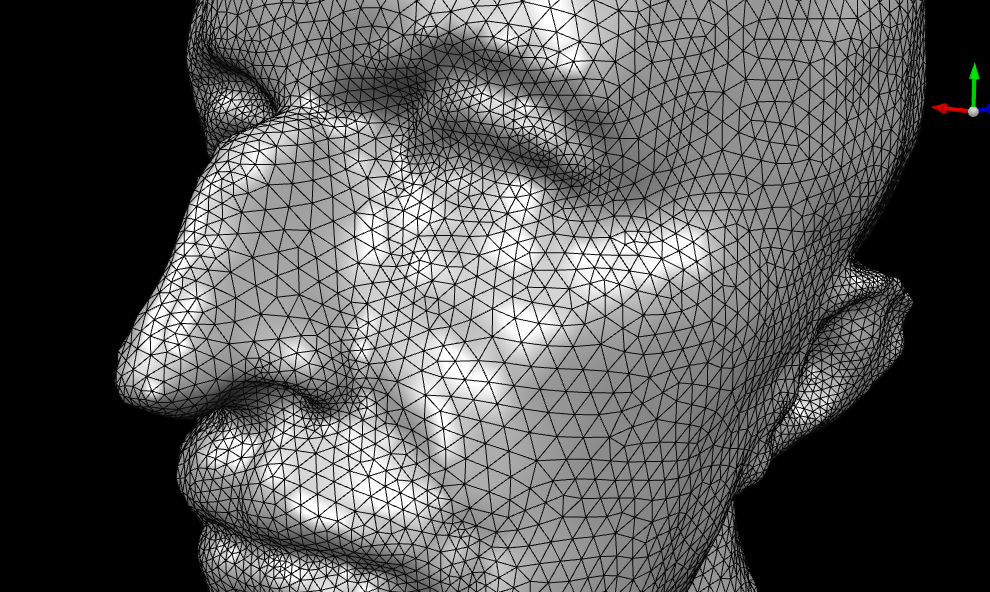
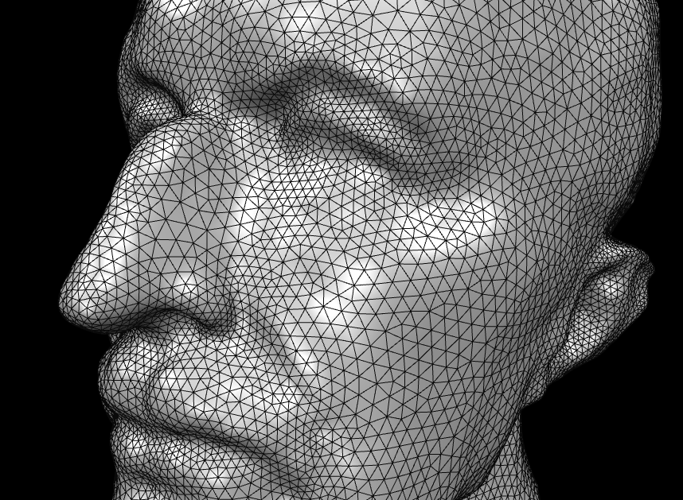

# exercises - series 9

## team members

- Simon Kolly
- Niklas Radomski
- Nicolas Willimann

## exercise notes

### exercise 3 - collapsing short edges

#### considered edge lengths

Depending on where we update the edge length cache and re-read values from it, the number of collapsed edges in a single iteration can vary by as much as 2,000 edges.

```raw
// original
collapsed 16536 edges

// move 'from' to 'to' and recalculate edge lengths
collapsed 16543 edges

// enqueue after operation
collapsed 17043 edges

// consider cache value in loop
14366
```

#### edge collapse undoes edge splitting

In the lecture, we derived the criterion as to when edges should be split or collapsed with the motivation that the deviation from the target length should be lower after the split than before the split.
From our observations during the implementation, it seems that this criterion is not strong enough.
When alternatively applying edge split and edge collapse operations, the latter mostly undoes the prior.
The number of collapsed edges decreases only very slowly over multiple iterations.

Analytically, it seems that this no coincidence:

$$
\begin{align*}
\text{split: }& L &\ge \frac{4}{3}T \\
\text{collapse (after preceding split): }& \frac{L}{2} &\le \frac{4}{5} T \\
& L &\le \frac{8}{5}T
\end{align*}
$$

Relating those two expressions yields:

$$
\Rightarrow \frac{4}{5} T \le L \le \frac{8}{5}T
$$

This suggests that any edge of length in $\left[\frac{4}{5} T, \frac{8}{5} T\right]$ will be both split and collapsed.

### exercise 5 - tangential relaxation

To decompose the mean normal vector $v$ into a normal ($v_n$) and a tangential ($v_t$) component, we solely need access to the vertex normal vector $n$:

$$
\begin{align*}
v_n &= (v \cdot n) \cdot n \\
v_t &= v - v_n
\end{align*}
$$

The tangential component is orthogonal to the normal component by definition.
The fact that $v_t$ indeed represents the tangential component can therefore be seen as follows:

$$
\begin{align*}
v_t \cdot n &= (v - v_n) \cdot n \\
&= (v - (v \cdot n) \cdot n) \cdot n \\
&= vn - (vn) \cdot (nn) \\
&= vn - vn \cdot 1 \\
&= 0
\end{align*}
$$

### exercise 6 - adaptive remeshing

#### importance of number of smoothing passes

Larger number of smoothing passes helps the local impact of curvature diffuse into its larger neighborhood.

Put differently: When we use multiple smoothing passes, high curvature in a small set of vertices does not only lower the target length of the edges in that local neighborhood, but also in the larger-scale neighborhood.
This reduction in target length then causes the smoothing algorithm to split edges more rigorously in that area, which causes the local resolution to increase.

Mesh obtained after 5 remeshing iterations when using adaptive edge lengths with a single smoothing pass:



Mesh obtained after 5 remeshing iterations when using adaptive edge lengths with five smoothing passes:



## encountered difficulties

### unclear plugin lifecylcle

When is the lifecycle method `init` called?
Does this ensure that the caches are properly updated when the mesh is modified?

### `OpenMesh::SmartRangeT::argmin` has undefined behavior for empty ranges

```cpp
OpenMesh::SmartHalfedgeHandle edge_to_be_collapsed = edge.halfedges()
    .filtered([](OpenMesh::SmartHalfedgeHandle halfedge) -> bool {
        // Boundary vertices must not be collapsed into non-boundary vertices
        return !(halfedge.from().is_boundary() && !halfedge.to().is_boundary());
    })
    .filtered([this](OpenMesh::SmartHalfedgeHandle halfedge) -> bool {
        // Halfedge must be collapsible
        return mesh_.is_collapse_ok(halfedge);
    })
    .argmin([](OpenMesh::SmartHalfedgeHandle halfedge) -> uint {
        // Lower valence vertex is merged into the higher valence vertex
        return halfedge.from().valence();
    });
```

This code may assign values to `edge_to_be_collapsed` that do not satisfy all the constraints imposed by the calls to `filtered`.
This happens whenever the calls to `filtered` return an empty range, as `argmin` does not properly support empty ranges.

This was not immediately obvious due to the following observations:

- `argmin` performs an assertion that ensures that the range is non-empty.
  Running with the debug profile was not possible, however, since loading the mesh with the bust of Max Planck reliably triggers an assertion.
- `is_collapse_ok` is not stateless.
  We therefore got distracted by investigating whether that method is nevertheless idempotent.

Ideally, `argmin` should gracefully handle empty ranges and use a return type that clearly indicates that there are cases in which no result exists, such as `std::optional`.
Alternatively, `argmin` could return invalid handles.

### `OpenMesh::BaseHandle::is_valid` is true for deleted objects

It seems obvious that `OpenMesh::BaseHandle::is_valid` solely indicates whether the handle itself is valid, and not whether the underlying object is still a valid object in the mesh.
This is less obvious when working with smart handles, as they blend handle-inherent and mesh-inherent information into a single API.

### `OpenMesh::SmartEdgeHandle::next` points to next boundary halfedge for boundary halfedges

This is very different from what the next pointer points to in a non-boundary neighborhood.
The interactive demo in lecture 5 (discrete differential geometry) properly shows this behavior but I feel that we mostly glossed over this small yet important detail.

This caught our attention since we implemented neighbor traversal ourselves using halfedges.
This naive implementation broke in boundary neighborhoods.
